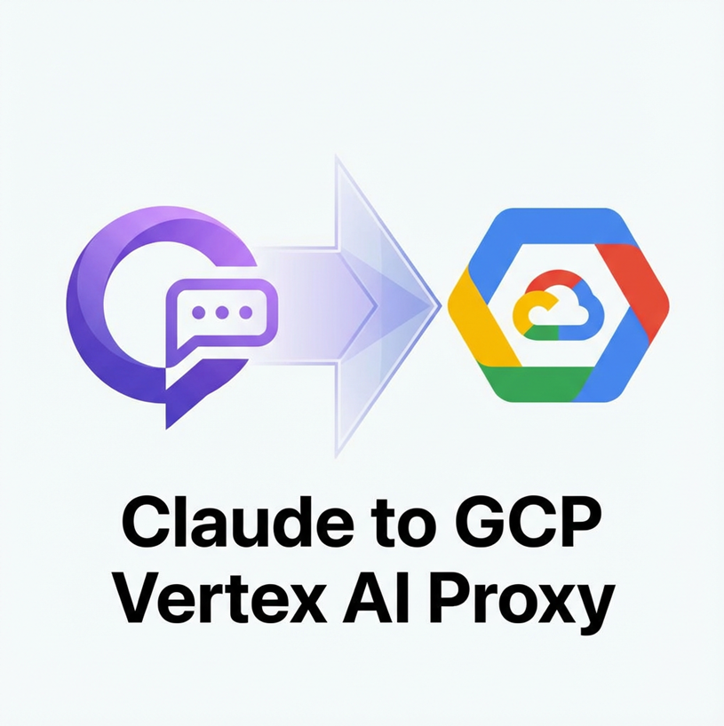

<p align="center">
  
</p>

<h1 align="center">Claude to GCP Vertex AI Proxy</h1>

<p align="center">
  <a href="https://www.python.org/"></a>
  <a href="LICENSE"></a>
  <a href="."></a>
  <a href="https://cloud.google.com/vertex-ai"></a>
  <a href="https://www.anthropic.com/"></a>
</p>

<p align="center">
  <a href="README_EN.md">English</a> | 中文
</p>

一个用于将 Claude API 请求转换为 Google Cloud Vertex AI 格式的代理服务，使 Claude Code 客户端能够通过 GCP Vertex AI 访问 Claude 模型。

## 声明

本项目是为 **Google Cloud Vertex AI 企业客户**提供的协议转换工具，旨在简化 Claude Code 客户端与 GCP Vertex AI 的集成流程。

**本项目：**
- ✅ 是合法的 API 协议转换工具
- ✅ 面向已具备 GCP Vertex AI Claude 模型访问权限的用户
- ✅ 遵循 Google Cloud 和 Anthropic 的服务条款
- ❌ 不提供任何绕过授权或网络监管的功能
- ❌ 不提供任何免费访问付费服务的途径

**使用前提：**
- 您必须拥有有效的 Google Cloud 账户
- 您必须已在 GCP 项目中启用 Vertex AI API
- 您必须具备 Claude 模型的访问权限（通过 Vertex AI Model Garden）

**合规要求：**
- 使用本工具时，您应遵守 Google Cloud Platform 服务条款
- 使用本工具时，您应遵守 Anthropic 使用政策
- 使用本工具时，您应遵守所在地区的法律法规

## 环境变量配置

本程序支持以下环境变量：

| 环境变量 | 说明 | 默认值 |
|----------|------|--------|
| `GCP_KEY_FILE` | GCP 服务账户 JSON 凭据文件路径 | `key/key.json` |
| `GCP_REGION` | GCP Vertex AI 区域（如 `global`、`us-east5`、`europe-west1` 等） | `global` |
| `SSL_VERIFY` | 是否验证 SSL 证书（设为 `false` 可用于 Charles/Fiddler 抓包调试） | `true` |

### 凭据配置

将 GCP 服务账户 JSON 凭据文件放置于 `key/key.json`（默认路径）。

如需自定义，可通过环境变量指定：

```bash
# Windows
set GCP_KEY_FILE=path/to/your-credentials.json

# Linux/Mac
export GCP_KEY_FILE=path/to/your-credentials.json
```

### 区域配置

默认使用 `global` 区域。如需指定其他区域：

```bash
# Windows
set GCP_REGION=us-east5

# Linux/Mac
export GCP_REGION=us-east5
```

## 快速开始

### 第一步：安装 Claude Code

1. **卸载旧版本**（如有）：
   ```bash
   npm uninstall -g claude-code
   npm uninstall -g @anthropic-ai/claude
   ```

2. **安装官方版本**：
   ```bash
   npm install -g @anthropic-ai/claude-code
   ```

### 第二步：启动代理服务

使用启动脚本（推荐，自动创建虚拟环境并安装依赖）：

```bash
# Linux/Mac
bash start_proxy.sh

# Windows
start_proxy.cmd
```

启动脚本会自动：
- 创建 Python 虚拟环境（`.venv`）
- 安装所需依赖
- 启动代理服务

服务将在 `http://0.0.0.0:8000` 启动。

### 第三步：配置环境变量

在新的终端窗口中设置以下环境变量：

```bash
# API Key 可填写任意值（本代理不使用此值进行认证）
export ANTHROPIC_API_KEY='placeholder'

# 指向代理服务地址
export ANTHROPIC_BASE_URL=http://127.0.0.1:8000
```

#### 推荐：使用 zcf 配置工具

可使用 [zcf (Zero-Config Flow for Claude Code)](https://github.com/UfoMiao/zcf) 进行持久化配置：

```bash
npx zcf
```

按界面提示完成配置即可。

### 第四步：使用 Claude Code

配置完成后，即可正常使用 Claude Code，所有请求将通过代理服务转发至 GCP Vertex AI。

## 验证服务状态

```bash
# 健康检查
curl http://127.0.0.1:8000/health

# 查看可用模型
curl http://127.0.0.1:8000/v1/models
```

## 常见问题

### Q: 代理服务启动失败

请检查：
- 凭据文件是否存在于 `key/key.json`（或 `GCP_KEY_FILE` 环境变量指定的路径）
- Python 依赖是否已正确安装
- 端口 8000 是否被占用

### Q: 响应延迟或超时

请检查：
- 网络连接是否稳定
- 防火墙是否阻止了出站连接
- GCP 服务状态是否正常

### Q: 权限错误

请确认：
- 服务账户具有 Vertex AI 访问权限
- GCP 项目已启用 Vertex AI API
- 凭据文件权限设置正确

## 技术说明

### API 端点

| 端点 | 说明 |
|------|------|
| `/v1/messages` | Claude 消息接口（支持流式/非流式） |
| `/v1/models` | 可用模型列表 |
| `/health` | 健康检查 |

### 日志文件

- `api_requests.log` - 详细请求/响应日志
- `api_requests_simple.log` - 精简对话日志

### 兼容性处理

- 自动移除 Vertex AI 不支持的 `input_examples` 字段
- 支持 Claude Code 模型名称映射
- 自动添加 `anthropic_version` 等必需字段

## 安全提醒

⚠️ **重要**：
- 凭据文件（`key/*.json`）已在 `.gitignore` 中排除，请勿手动提交
- 建议仅在受信任的网络环境中运行本服务
- 定期轮换服务账户密钥

## 许可证

本项目采用 [Apache License 2.0](LICENSE) 开源。